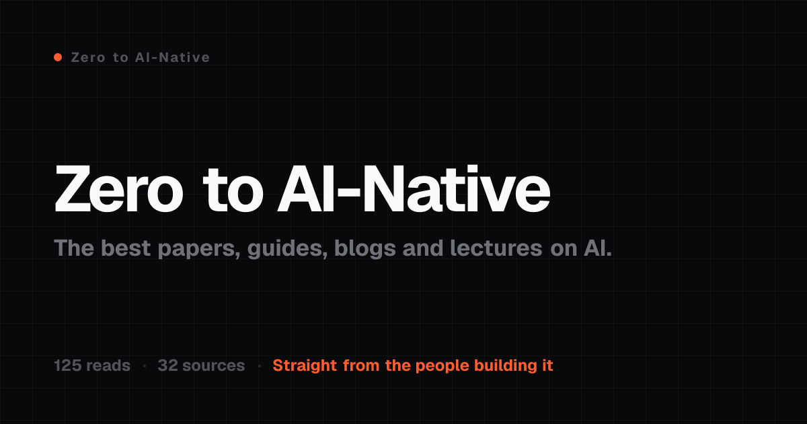

<div align="center">



# zero to ai-native

**the best papers, guides, blogs and lectures on ai, straight from the people building it.**


[](#-contributing)


</div>

---

the best explanations of ai aren't in courses or viral threads. they're written by the people **building** it, then scattered across a hundred cdns, arxiv links and personal blogs you'd never stumble on.

this is every one worth reading, in one place. **94 hand-picked reads** from **33 sources**. no listicles, no reuploads, no seo slop. just the primary sources, ordered the way you'd actually learn them.

read your way down this page and you go from zero to ai-native.

## 🚀 start here

brand new? these five take you from "what is a neural net" to "i get how this works", in order:

1. **[Neural Networks](https://www.youtube.com/playlist?list=PLZHQObOWTQDNU6R1_67000Dx_ZCJB-3pi)** · 3Blue1Brown · the visual intuition, zero math required
2. **[Neural Networks: Zero to Hero](https://www.youtube.com/playlist?list=PLPXYLzZ3XzIbi4lL43O6fIU_ojuZwBO6vi)** · Karpathy · build one from scratch in plain python
3. **[The Illustrated Transformer](https://jalammar.github.io/illustrated-transformer/)** · Jay Alammar · how attention actually works
4. **[Prompt Engineering](https://www.kaggle.com/whitepaper-prompt-engineering)** · Google · the 69-page whitepaper that still holds up
5. **[Building Effective AI Agents](https://www.anthropic.com/engineering/building-effective-agents)** · Anthropic · once you're ready to build

then pick a topic below and go deep.

## 📚 the list

### 🤖 Agents

- **[Building Effective AI Agents](https://resources.anthropic.com/hubfs/Building%20Effective%20AI%20Agents-%20Architecture%20Patterns%20and%20Implementation%20Frameworks.pdf)** · [Anthropic](https://www.anthropic.com) · 📄 pdf · 2025
- **[Building Effective Agents (essay)](https://www.anthropic.com/engineering/building-effective-agents)** · [Anthropic](https://www.anthropic.com) · 🌐 web · 2024
- **[A Practical Guide to Building Agents](https://cdn.openai.com/business-guides-and-resources/a-practical-guide-to-building-agents.pdf)** · [OpenAI](https://openai.com) · 📄 pdf · 2025
- **[Agents](https://www.kaggle.com/whitepaper-agents)** · [Google](https://deepmind.google) · 📄 pdf · 2025
- **[Agents Companion](https://www.kaggle.com/whitepaper-agent-companion)** · [Google](https://deepmind.google) · 📄 pdf · 2025
- **[AI Agents for Beginners](https://github.com/microsoft/ai-agents-for-beginners)** · [Microsoft](https://www.microsoft.com/ai) · 🎓 course · 2025
- **[Agentic AI on the Rise](https://pages.awscloud.com/rs/112-TZM-766/images/AWS_Marketplace_ebook_Agentic_AI.pdf)** · [AWS](https://aws.amazon.com) · 📄 pdf · 2025
- **[AI Agents Course](https://huggingface.co/learn/agents-course)** · [Hugging Face](https://huggingface.co) · 🎓 course · 2025
- **[LLM Powered Autonomous Agents](https://lilianweng.github.io/posts/2023-06-23-agent/)** · [Lilian Weng](https://lilianweng.github.io) · ✍️ blog · 2023

### 💬 Prompt Engineering

- **[GPT-5 Prompting Guide](https://cookbook.openai.com/examples/gpt-5/gpt-5_prompting_guide)** · [OpenAI](https://openai.com) · 🌐 web · 2025
- **[Prompt Engineering](https://www.kaggle.com/whitepaper-prompt-engineering)** · [Google](https://deepmind.google) · 📄 pdf · 2024
- **[Gemini for Workspace Prompting Guide 101](https://services.google.com/fh/files/misc/gemini_for_workspace_prompt_guide_october_2024_digital_final.pdf)** · [Google](https://deepmind.google) · 📄 pdf · 2024
- **[Gemini Enterprise Prompt Guide](https://cloud.google.com/gemini-enterprise/resources/prompt-guide)** · [Google](https://deepmind.google) · 🌐 web · 2025
- **[Prompt Engineering Interactive Tutorial](https://github.com/anthropics/prompt-eng-interactive-tutorial)** · [Anthropic](https://www.anthropic.com) · 🎓 course · 2025
- **[GPT-4.1 Prompting Guide](https://cookbook.openai.com/examples/gpt4-1_prompting_guide)** · [OpenAI](https://openai.com) · 🌐 web · 2025
- **[Llama Prompting Guide](https://www.llama.com/docs/how-to-guides/prompting/)** · [Meta](https://ai.meta.com) · 🌐 web · 2025
- **[Prompting Capabilities](https://docs.mistral.ai/capabilities/completion/prompting_capabilities)** · [Mistral](https://mistral.ai) · 🌐 web · 2025
- **[DeepSeek-R1 Usage Recommendations](https://github.com/deepseek-ai/DeepSeek-R1)** · [DeepSeek](https://www.deepseek.com) · 🌐 web · 2025
- **[Prompt Engineering (In-Context Prompting)](https://lilianweng.github.io/posts/2023-03-15-prompt-engineering/)** · [Lilian Weng](https://lilianweng.github.io) · ✍️ blog · 2023

### 🧠 Context & Harness

- **[Effective Context Engineering for AI Agents](https://www.anthropic.com/engineering/effective-context-engineering-for-ai-agents)** · [Anthropic](https://www.anthropic.com) · 🌐 web · 2025
- **[Context Rot: How Input Length Hurts LLM Performance](https://research.trychroma.com/context-rot)** · [Chroma](https://www.trychroma.com) · 🌐 web · 2025

### 📐 Foundations

- **[Foundational LLMs & Text Generation](https://www.kaggle.com/whitepaper-foundational-llm-and-text-generation)** · [Google](https://deepmind.google) · 📄 pdf · 2025
- **[Embeddings & Vector Stores](https://www.kaggle.com/learn-guide/5-day-genai)** · [Google](https://deepmind.google) · 📄 pdf · 2025
- **[Generative AI for Beginners](https://microsoft.github.io/generative-ai-for-beginners/)** · [Microsoft](https://www.microsoft.com/ai) · 🎓 course · 2025
- **[Gemini (whitepaper)](https://www.android.com/static/pdf/gemini-whitepaper.pdf)** · [Google](https://deepmind.google) · 📄 pdf · 2025
- **[LLM University (LLMU)](https://cohere.com/llmu)** · [Cohere](https://cohere.com) · 🎓 course · 2025
- **[LLM Course](https://huggingface.co/learn/llm-course)** · [Hugging Face](https://huggingface.co) · 🎓 course · 2025
- **[Deep RL Course](https://huggingface.co/learn/deep-rl-course)** · [Hugging Face](https://huggingface.co) · 🎓 course · 2025
- **[Extrinsic Hallucinations in LLMs](https://lilianweng.github.io/posts/2024-07-07-hallucination/)** · [Lilian Weng](https://lilianweng.github.io) · ✍️ blog · 2024
- **[Reward Hacking in Reinforcement Learning](https://lilianweng.github.io/posts/2024-11-28-reward-hacking/)** · [Lilian Weng](https://lilianweng.github.io) · ✍️ blog · 2024
- **[Things We Learned About LLMs in 2024](https://simonwillison.net/2024/Dec/31/llms-in-2024/)** · [Simon Willison](https://simonwillison.net) · ✍️ blog · 2024
- **[Neural Networks: Zero to Hero](https://www.youtube.com/playlist?list=PLPXYLzZ3XzIbi4lL43O6fIU_ojuZwBO6vi)** · [Andrej Karpathy](https://karpathy.ai) · 🎥 video · 2023
- **[Deep Dive into LLMs like ChatGPT](https://www.youtube.com/watch?v=7xTGNNLPyMI)** · [Andrej Karpathy](https://karpathy.ai) · 🎥 video · 2025
- **[CS229: Machine Learning](https://www.youtube.com/playlist?list=PLoROMvodv4rMiGQp3WXShtMGgzqpfVfbU)** · [Stanford](https://online.stanford.edu) · 🎥 video · 2022
- **[CS224N: NLP with Deep Learning](https://www.youtube.com/playlist?list=PLoROMvodv4rOaMFbaqxPDoLWjDaRAdP9D)** · [Stanford](https://online.stanford.edu) · 🎥 video · 2024
- **[CS336: Language Modeling from Scratch](https://www.youtube.com/playlist?list=PLoROMvodv4rOY23Y0BoGoBGgQ1zmU_MT_)** · [Stanford](https://online.stanford.edu) · 🎥 video · 2025
- **[CS25: Transformers United](https://www.youtube.com/playlist?list=PLoROMvodv4rNiJRchCzutFw5ItR_Z27CM)** · [Stanford](https://online.stanford.edu) · 🎥 video · 2025
- **[6.S191: Introduction to Deep Learning](https://www.youtube.com/playlist?list=PLtBw6njQRU-rwp5__7C0oIVt26ZgjG9NI)** · [MIT](https://www.mit.edu) · 🎥 video · 2025
- **[The Illustrated Transformer](https://jalammar.github.io/illustrated-transformer/)** · [Jay Alammar](https://jalammar.github.io) · ✍️ blog · 2018
- **[Neural Networks](https://www.youtube.com/playlist?list=PLZHQObOWTQDNU6R1_67000Dx_ZCJB-3pi)** · [3Blue1Brown](https://www.3blue1brown.com) · 🎥 video · 2024
- **[Ahead of AI](https://magazine.sebastianraschka.com/)** · [Sebastian Raschka](https://sebastianraschka.com) · ✍️ blog · 2025
- **[Simon Willison on LLMs (weblog)](https://simonwillison.net/tags/llms/)** · [Simon Willison](https://simonwillison.net) · ✍️ blog · 2025

### 📜 Papers

- **[Attention Is All You Need](https://arxiv.org/pdf/1706.03762)** · [Google](https://deepmind.google) · 📄 pdf · 2017
- **[Language Models are Few-Shot Learners (GPT-3)](https://arxiv.org/pdf/2005.14165)** · [OpenAI](https://openai.com) · 📄 pdf · 2020
- **[BERT: Pre-training of Deep Bidirectional Transformers](https://arxiv.org/pdf/1810.04805)** · [Google](https://deepmind.google) · 📄 pdf · 2018
- **[Training Language Models to Follow Instructions (InstructGPT)](https://arxiv.org/pdf/2203.02155)** · [OpenAI](https://openai.com) · 📄 pdf · 2022
- **[Chain-of-Thought Prompting Elicits Reasoning](https://arxiv.org/pdf/2201.11903)** · [Google](https://deepmind.google) · 📄 pdf · 2022
- **[Training Compute-Optimal LLMs (Chinchilla)](https://arxiv.org/pdf/2203.15556)** · [Google](https://deepmind.google) · 📄 pdf · 2022
- **[LLaMA: Open and Efficient Foundation Language Models](https://arxiv.org/pdf/2302.13971)** · [Meta](https://ai.meta.com) · 📄 pdf · 2023
- **[Retrieval-Augmented Generation (RAG)](https://arxiv.org/pdf/2005.11401)** · [Meta](https://ai.meta.com) · 📄 pdf · 2020
- **[LoRA: Low-Rank Adaptation of Large Language Models](https://arxiv.org/pdf/2106.09685)** · [Microsoft](https://www.microsoft.com/ai) · 📄 pdf · 2021
- **[Constitutional AI: Harmlessness from AI Feedback](https://arxiv.org/pdf/2212.08073)** · [Anthropic](https://www.anthropic.com) · 📄 pdf · 2022
- **[Mixtral of Experts](https://arxiv.org/pdf/2401.04088)** · [Mistral](https://mistral.ai) · 📄 pdf · 2024
- **[Mistral 7B](https://arxiv.org/pdf/2310.06825)** · [Mistral](https://mistral.ai) · 📄 pdf · 2023
- **[DeepSeek-R1: Incentivizing Reasoning via RL](https://arxiv.org/pdf/2501.12948)** · [DeepSeek](https://www.deepseek.com) · 📄 pdf · 2025
- **[DeepSeek-V3 Technical Report](https://arxiv.org/pdf/2412.19437)** · [DeepSeek](https://www.deepseek.com) · 📄 pdf · 2024
- **[YaRN: Efficient Context Window Extension](https://arxiv.org/pdf/2309.00071)** · Nous Research · 📄 pdf · 2023
- **[Qwen2.5 Technical Report](https://arxiv.org/pdf/2412.15115)** · [Qwen](https://qwenlm.github.io) · 📄 pdf · 2024
- **[Kimi K2: Open Agentic Intelligence](https://arxiv.org/pdf/2507.20534)** · [Moonshot AI](https://www.moonshot.ai) · 📄 pdf · 2025
- **[GLM-4.5: Agentic, Reasoning and Coding Foundation Models](https://arxiv.org/pdf/2508.06471)** · [Zhipu AI](https://z.ai) · 📄 pdf · 2025
- **[MiniMax-01: Scaling with Lightning Attention](https://arxiv.org/pdf/2501.08313)** · [MiniMax](https://www.minimax.io) · 📄 pdf · 2025
- **[Hunyuan-Large](https://arxiv.org/pdf/2411.02265)** · [Tencent](https://hunyuan.tencent.com) · 📄 pdf · 2024
- **[Yi: Open Foundation Models by 01.AI](https://arxiv.org/pdf/2403.04652)** · [01.AI](https://www.01.ai) · 📄 pdf · 2024
- **[Seed1.5-Thinking: Reasoning Models via RL](https://arxiv.org/pdf/2504.13914)** · [ByteDance](https://seed.bytedance.com) · 📄 pdf · 2025

### 🏢 Enterprise & Adoption

- **[Building Trusted AI in the Enterprise](https://assets.anthropic.com/m/66daaa23018ab0fd/original/Anthropic-enterprise-ebook-digital.pdf)** · [Anthropic](https://www.anthropic.com) · 📄 pdf · 2025
- **[Identifying and Scaling AI Use Cases](https://cdn.openai.com/business-guides-and-resources/identifying-and-scaling-ai-use-cases.pdf)** · [OpenAI](https://openai.com) · 📄 pdf · 2025
- **[AI in the Enterprise](https://cdn.openai.com/business-guides-and-resources/ai-in-the-enterprise.pdf)** · [OpenAI](https://openai.com) · 📄 pdf · 2025
- **[Generative AI in Practice](https://www.nvidia.com/en-us/data-center/generative-ai-in-practice/)** · [NVIDIA](https://www.nvidia.com) · 🌐 web · 2025
- **[The Financial Services Guide to Building Autonomous AI Agents](https://resources.anthropic.com/financial-services-guide-aws-anthropic)** · [Anthropic](https://www.anthropic.com) · 🌐 web · 2025
- **[Llama Responsible Use Guide](https://github.com/meta-llama/llama/blob/main/Responsible-Use-Guide.pdf)** · [Meta](https://ai.meta.com) · 📄 pdf · 2024
- **[CS153: Frontier Systems](https://www.youtube.com/playlist?list=PLoROMvodv4rN447WKQ5oz_YdYbS74M5IA)** · [Stanford](https://online.stanford.edu) · 🎥 video · 2026

### ⚙️ MLOps & Production

- **[From Experiments to Deployments](https://cdn.openai.com/business-guides-and-resources/from-experiments-to-deployments_whitepaper_11-25.pdf)** · [OpenAI](https://openai.com) · 📄 pdf · 2025
- **[Solving Domain-Specific Problems & MLOps for Gen AI](https://www.kaggle.com/learn-guide/5-day-genai)** · [Google](https://deepmind.google) · 🎓 course · 2025
- **[Generative AI Lens (Well-Architected)](https://docs.aws.amazon.com/pdfs/wellarchitected/latest/generative-ai-lens/generative-ai-lens.pdf)** · [AWS](https://aws.amazon.com) · 📄 pdf · 2025
- **[Evaluation Best Practices](https://developers.openai.com/api/docs/guides/evaluation-best-practices)** · [OpenAI](https://openai.com) · 🌐 web · 2025
- **[Fine-tuning Best Practices](https://developers.openai.com/api/docs/guides/fine-tuning-best-practices)** · [OpenAI](https://openai.com) · 🌐 web · 2025
- **[Smol Course](https://huggingface.co/learn/smol-course)** · [Hugging Face](https://huggingface.co) · 🎓 course · 2025
- **[Evaluating Chunking Strategies for Retrieval](https://research.trychroma.com/evaluating-chunking)** · [Chroma](https://www.trychroma.com) · 🌐 web · 2024
- **[Generative Benchmarking](https://research.trychroma.com/generative-benchmarking)** · [Chroma](https://www.trychroma.com) · 🌐 web · 2025
- **[Patterns for Building LLM-based Systems & Products](https://eugeneyan.com/writing/llm-patterns/)** · [Eugene Yan](https://eugeneyan.com) · ✍️ blog · 2023
- **[What We Learned from a Year of Building with LLMs](https://applied-llms.org/)** · [Eugene Yan](https://eugeneyan.com) · ✍️ blog · 2024
- **[Your AI Product Needs Evals](https://hamel.dev/blog/posts/evals/)** · [Hamel Husain](https://hamel.dev) · ✍️ blog · 2024
- **[A Field Guide to Rapidly Improving AI Products](https://hamel.dev/blog/posts/field-guide/)** · [Hamel Husain](https://hamel.dev) · ✍️ blog · 2025
- **[Building LLM Applications for Production](https://huyenchip.com/2023/04/11/llm-engineering.html)** · [Chip Huyen](https://huyenchip.com) · ✍️ blog · 2023

### 🛠️ Skills & Tooling

- **[The Complete Guide to Building Skills for Claude](https://resources.anthropic.com/hubfs/The-Complete-Guide-to-Building-Skill-for-Claude.pdf)** · [Anthropic](https://www.anthropic.com) · 📄 pdf · 2025
- **[Claude Code: Best Practices for Agentic Coding](https://www.anthropic.com/engineering/claude-code-best-practices)** · [Anthropic](https://www.anthropic.com) · 🌐 web · 2025

### 📊 Research & Economics

- **[Anthropic Economic Index: Economic Primitives](https://www-cdn.anthropic.com/096d94c1a91c6480806d8f24b2344c7e2a4bc666.pdf)** · [Anthropic](https://www.anthropic.com) · 📄 pdf · 2025
- **[Anthropic Economic Index: Geographic & Enterprise Adoption](https://assets.anthropic.com/m/218c82b858610fac/original/Economic-Index.pdf)** · [Anthropic](https://www.anthropic.com) · 📄 pdf · 2025
- **[The State of Enterprise AI 2025](https://cdn.openai.com/pdf/7ef17d82-96bf-4dd1-9df2-228f7f377a29/the-state-of-enterprise-ai_2025-report.pdf)** · [OpenAI](https://openai.com) · 📄 pdf · 2025
- **[Work Trend Index 2023 Special Report](https://assets-c4akfrf5b4d3f4b7.z01.azurefd.net/assets/2023/11/Microsoft_Work_Trend_Index_Special_Report_2023_Full_Report.pdf)** · [Microsoft](https://www.microsoft.com/ai) · 📄 pdf · 2023
- **[Gemini 3 Pro Frontier Safety Framework Report](https://storage.googleapis.com/deepmind-media/gemini/gemini_3_pro_fsf_report.pdf)** · [Google](https://deepmind.google) · 📄 pdf · 2025
- **[The Economics of Transformative AI](https://www.nber.org/books-and-chapters/economics-transformative-ai)** · [NBER](https://www.nber.org) · 🌐 web · 2025
- **[MS&E435: Economics of the AI Supercycle](https://www.youtube.com/@MSE435EconomicsofAI)** · [Stanford](https://online.stanford.edu) · 🎥 video · 2026
- **[AI Eats the World](https://www.ben-evans.com/presentations)** · [Benedict Evans](https://www.ben-evans.com) · 🌐 web · 2025

## 🙏 sources &amp; credits

every link goes to a primary source. these are the people and labs who did the work. go follow them, they earned it.

**the labs** · [Anthropic](https://www.anthropic.com) ([@AnthropicAI](https://x.com/AnthropicAI)) · [OpenAI](https://openai.com) ([@OpenAI](https://x.com/OpenAI)) · [Google](https://deepmind.google) ([@GoogleDeepMind](https://x.com/GoogleDeepMind)) · [Meta](https://ai.meta.com) ([@AIatMeta](https://x.com/AIatMeta)) · [Microsoft](https://www.microsoft.com/ai) · [Mistral](https://mistral.ai) ([@MistralAI](https://x.com/MistralAI)) · [Cohere](https://cohere.com) ([@cohere](https://x.com/cohere)) · [Hugging Face](https://huggingface.co) ([@huggingface](https://x.com/huggingface)) · [Chroma](https://www.trychroma.com) ([@trychroma](https://x.com/trychroma)) · [DeepSeek](https://www.deepseek.com) ([@deepseek_ai](https://x.com/deepseek_ai)) · [Qwen](https://qwenlm.github.io) ([@Alibaba_Qwen](https://x.com/Alibaba_Qwen)) · [Moonshot AI](https://www.moonshot.ai) · [Zhipu AI](https://z.ai) · [MiniMax](https://www.minimax.io) · [Tencent](https://hunyuan.tencent.com) · [01.AI](https://www.01.ai) · [ByteDance](https://seed.bytedance.com) · [NVIDIA](https://www.nvidia.com) ([@nvidia](https://x.com/nvidia)) · [AWS](https://aws.amazon.com) ([@awscloud](https://x.com/awscloud))

**the people** · [Andrej Karpathy](https://karpathy.ai) ([@karpathy](https://x.com/karpathy)) · [Lilian Weng](https://lilianweng.github.io) ([@lilianweng](https://x.com/lilianweng)) · [Simon Willison](https://simonwillison.net) ([@simonw](https://x.com/simonw)) · [Chip Huyen](https://huyenchip.com) ([@chipro](https://x.com/chipro)) · [Hamel Husain](https://hamel.dev) ([@HamelHusain](https://x.com/HamelHusain)) · [Eugene Yan](https://eugeneyan.com) ([@eugeneyan](https://x.com/eugeneyan)) · [Jay Alammar](https://jalammar.github.io) ([@JayAlammar](https://x.com/JayAlammar)) · [Sebastian Raschka](https://sebastianraschka.com) ([@rasbt](https://x.com/rasbt)) · [Benedict Evans](https://www.ben-evans.com) ([@benedictevans](https://x.com/benedictevans)) · [3Blue1Brown](https://www.3blue1brown.com) ([@3blue1brown](https://x.com/3blue1brown))

**the schools** · [Stanford](https://online.stanford.edu) · [MIT](https://www.mit.edu) · [NBER](https://www.nber.org)

## ✍️ contributing

found a banger that's missing? the whole catalog is one typed file: [`lib/guides.ts`](lib/guides.ts). add an entry and open a PR:

```ts
{
  title: "The Title",
  company: "Anthropic",        // a source in lib/taxonomy.ts
  topic: "Agents",
  url: "https://...",          // primary source only, no reuploads
  format: "PDF",               // PDF | Web | Blog | Course | Video
  year: 2025,
  level: "build",              // intro | build | deep
  audience: "builder",
  description: "one plain line on why it's worth reading.",
}
```

**rules:** primary sources only, no reuploads, no affiliate links, no slop. one plain sentence per entry. or just [open an issue](https://github.com/tushaarmehtaa/zero-to-ai-native/issues) and i'll add it.

## 🛠️ run it

```bash
git clone https://github.com/tushaarmehtaa/zero-to-ai-native
cd zero-to-ai-native
npm install && npm run dev
```

next.js · geist · tailwind · motion. static, no backend.

---

<div align="center">

built by [**@tushaarmehtaa**](https://x.com/tushaarmehtaa). i build with ai and write about it.

**if this saved you a few hours of googling, [star it](https://github.com/tushaarmehtaa/zero-to-ai-native) ⭐ so the next person finds it.**

</div>
